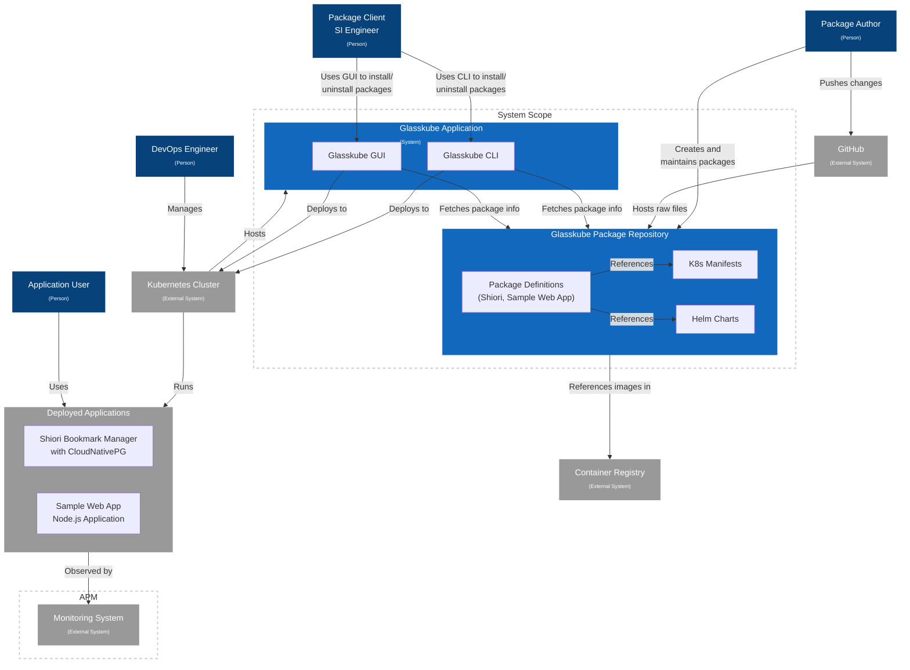

# Glasskube Package Repository Architecture

This diagram illustrates the high-level architecture of the Glasskube Package Repository system using the C4 model contextual approach.

## Diagram Components

### Personas
- **Package Author**: Creates and maintains packages in the repository
- **Package Client (SI Engineer)**: Uses Glasskube tools to install/uninstall packages
- **DevOps Engineer**: Manages Kubernetes clusters
- **Application User**: End user who interacts with deployed applications

### Systems
- **Glasskube Package Repository**: Central system containing package definitions and references to K8s manifests and Helm charts
- **Glasskube Application**: System running on Kubernetes that includes:
  - **Glasskube CLI**: Command-line interface component for managing packages
  - **Glasskube GUI**: Graphical interface component for managing packages

### External Systems
- **GitHub**: Hosts raw files for the package repository
- **Kubernetes Cluster**: Target deployment environment for packages and hosts the Glasskube Application
- **Container Registry**: Stores container images referenced by packages
- **Monitoring System**: Observes deployed applications (within APM scope)
- **Deployed Applications**: Applications deployed to Kubernetes clusters

### Scopes
- **System Scope**: Encompasses the Glasskube Package Repository and its tools
- **APM Scope**: Application Performance Monitoring scope 